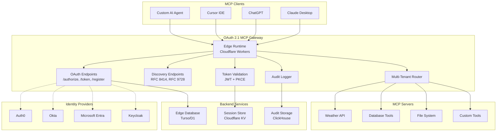
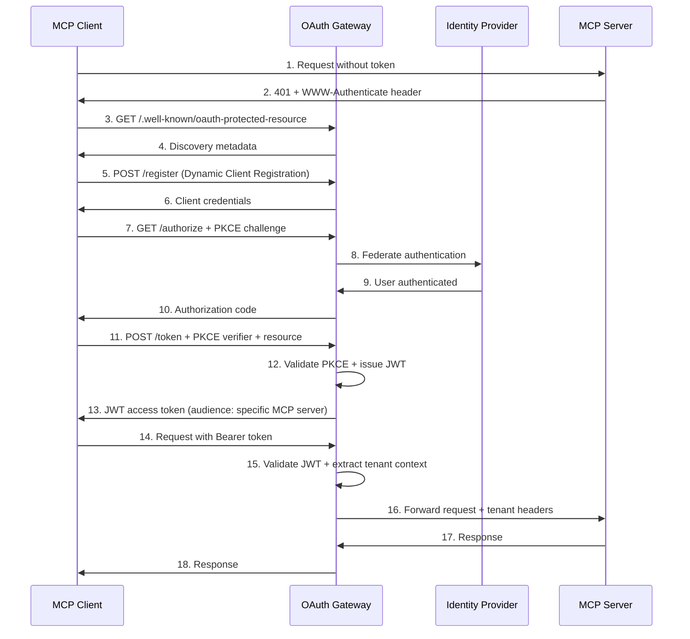

# OAuth 2.1 MCP Gateway - Design Document

## Overview

The OAuth 2.1 MCP Gateway is a cloud-native authentication proxy that transforms the MCP ecosystem from insecure static API keys to enterprise-grade OAuth 2.1 authentication. The gateway implements a separation of concerns where it acts as the OAuth 2.1 authorization server while MCP servers become stateless resource servers that only validate JWT tokens.

### Key Design Principles

- **Stateless Architecture**: Enable horizontal scaling and zero-downtime deployments
- **Edge-First**: Deploy globally with sub-10ms latency using edge computing platforms
- **Security by Default**: Implement OAuth 2.1, PKCE, and Resource Indicators as mandatory features
- **Developer Experience**: Zero-configuration setup with comprehensive documentation
- **Multi-Tenant Native**: Built-in tenant isolation and management from day one

## Architecture

### High-Level System Architecture



### OAuth 2.1 Flow Architecture



## Components and Interfaces

### 1. OAuth 2.1 Authorization Server

**Core Responsibilities:**
- Implement RFC 6749 (OAuth 2.0) with RFC 8252 (OAuth 2.1) security enhancements
- Enforce PKCE (RFC 7636) for all authorization code flows
- Support Resource Indicators (RFC 8707) for audience-specific tokens
- Provide Discovery endpoints (RFC 8414, RFC 9728)
- Handle Dynamic Client Registration (RFC 7591)

**Key Interfaces:**

```typescript
interface OAuthEndpoints {
  // Authorization endpoint with PKCE enforcement
  authorize(request: AuthorizeRequest): Promise<AuthorizeResponse>;
  
  // Token endpoint with PKCE validation and resource binding
  token(request: TokenRequest): Promise<TokenResponse>;
  
  // Dynamic client registration
  register(request: ClientRegistrationRequest): Promise<ClientRegistrationResponse>;
  
  // Discovery endpoints
  authorizationServerMetadata(): AuthorizationServerMetadata;
  protectedResourceMetadata(): ProtectedResourceMetadata;
}

interface AuthorizeRequest {
  client_id: string;
  redirect_uri: string;
  response_type: 'code';
  scope: string;
  state: string;
  code_challenge: string;
  code_challenge_method: 'S256';
  resource?: string; // RFC 8707
}

interface TokenRequest {
  grant_type: 'authorization_code' | 'refresh_token';
  code?: string;
  redirect_uri?: string;
  client_id: string;
  code_verifier: string; // PKCE verifier
  resource: string; // RFC 8707 - mandatory for MCP
  refresh_token?: string;
}
```

### 2. Multi-Tenant Management System

**Architecture Pattern:** Row-Level Security with tenant_id isolation

```typescript
interface TenantManager {
  // Tenant lifecycle management
  createTenant(config: TenantConfig): Promise<Tenant>;
  updateTenant(tenantId: string, config: Partial<TenantConfig>): Promise<void>;
  deleteTenant(tenantId: string): Promise<void>;
  
  // Tenant-aware database operations
  query<T>(sql: string, params: any[], tenantId: string): Promise<T[]>;
  
  // API key management with rotation
  rotateApiKey(tenantId: string): Promise<{ primary: string; secondary: string }>;
  validateApiKey(key: string): Promise<TenantContext | null>;
}

interface TenantConfig {
  name: string;
  domain: string;
  max_users: number;
  max_mcp_servers: number;
  compliance_tier: 'standard' | 'hipaa' | 'pci-dss';
  audit_retention_days: number;
  rate_limits: RateLimitConfig;
}

interface TenantContext {
  tenant_id: string;
  user_id: string;
  email: string;
  roles: string[];
  permissions: string[];
}
```

### 3. Token Validation and Routing Engine

**Stateless JWT Validation:**

```typescript
interface TokenValidator {
  validateToken(token: string, expectedAudience: string): Promise<TokenPayload>;
  extractTenantContext(token: string): Promise<TenantContext>;
  checkScopes(tokenScopes: string[], requiredScopes: string[]): boolean;
}

interface TokenPayload {
  sub: string; // User ID
  iss: string; // Issuer
  aud: string; // Audience (specific MCP server)
  exp: number; // Expiration
  iat: number; // Issued at
  tenant_id: string;
  scope: string;
  device_id?: string;
  session_id: string;
}

interface MCPRouter {
  routeRequest(request: Request, tenantContext: TenantContext): Promise<Response>;
  registerMCPServer(config: MCPServerConfig): Promise<void>;
  healthCheck(serverId: string): Promise<HealthStatus>;
}
```

### 4. Audit and Compliance System

**Structured Logging with Compliance Support:**

```typescript
interface AuditLogger {
  logAuthenticationEvent(event: AuthEvent): Promise<void>;
  logAuthorizationEvent(event: AuthzEvent): Promise<void>;
  logMCPToolInvocation(event: ToolEvent): Promise<void>;
  queryAuditLogs(filter: AuditFilter): Promise<AuditLogEntry[]>;
}

interface AuditLogEntry {
  log_id: string;
  timestamp: Date;
  event_type: 'auth.login' | 'auth.token_issued' | 'tool.invoked' | 'resource.accessed';
  user_id: string;
  tenant_id: string;
  ip_address: string;
  user_agent: string;
  outcome: 'success' | 'failure' | 'denied';
  resource_type: string;
  compliance_tags: string[]; // ['pci-dss', 'hipaa', 'gdpr']
  risk_score?: number;
}
```

## Data Models

### Core Database Schema

```sql
-- Tenants table with compliance configuration
CREATE TABLE tenants (
  tenant_id UUID PRIMARY KEY DEFAULT gen_random_uuid(),
  name VARCHAR(255) NOT NULL,
  domain VARCHAR(255) UNIQUE NOT NULL,
  compliance_tier VARCHAR(50) DEFAULT 'standard',
  max_users INTEGER DEFAULT 100,
  max_mcp_servers INTEGER DEFAULT 10,
  audit_retention_days INTEGER DEFAULT 365,
  created_at TIMESTAMP DEFAULT NOW(),
  updated_at TIMESTAMP DEFAULT NOW()
);

-- OAuth clients with PKCE support
CREATE TABLE oauth_clients (
  client_id VARCHAR(255) PRIMARY KEY,
  client_secret VARCHAR(255), -- Optional for public clients
  tenant_id UUID REFERENCES tenants(tenant_id) ON DELETE CASCADE,
  redirect_uris TEXT[] NOT NULL,
  grant_types VARCHAR(255)[] DEFAULT ARRAY['authorization_code', 'refresh_token'],
  response_types VARCHAR(255)[] DEFAULT ARRAY['code'],
  scope VARCHAR(500) DEFAULT 'mcp:tools:read mcp:resources:read',
  created_at TIMESTAMP DEFAULT NOW(),
  expires_at TIMESTAMP -- For client credential rotation
);

-- Authorization codes with PKCE challenge
CREATE TABLE authorization_codes (
  code VARCHAR(255) PRIMARY KEY,
  client_id VARCHAR(255) REFERENCES oauth_clients(client_id) ON DELETE CASCADE,
  user_id VARCHAR(255) NOT NULL,
  tenant_id UUID REFERENCES tenants(tenant_id) ON DELETE CASCADE,
  redirect_uri VARCHAR(500) NOT NULL,
  scope VARCHAR(500),
  code_challenge VARCHAR(255) NOT NULL,
  code_challenge_method VARCHAR(10) DEFAULT 'S256',
  resource VARCHAR(255), -- RFC 8707
  expires_at TIMESTAMP NOT NULL,
  created_at TIMESTAMP DEFAULT NOW()
);

-- MCP server registry
CREATE TABLE mcp_servers (
  server_id UUID PRIMARY KEY DEFAULT gen_random_uuid(),
  tenant_id UUID REFERENCES tenants(tenant_id) ON DELETE CASCADE,
  name VARCHAR(255) NOT NULL,
  endpoint_url VARCHAR(500) NOT NULL,
  resource_identifier VARCHAR(255) UNIQUE NOT NULL, -- For RFC 8707
  required_scopes VARCHAR(500)[],
  health_check_url VARCHAR(500),
  status VARCHAR(50) DEFAULT 'active',
  created_at TIMESTAMP DEFAULT NOW()
);

-- API keys with rotation support
CREATE TABLE api_keys (
  key_id UUID PRIMARY KEY DEFAULT gen_random_uuid(),
  key_hash VARCHAR(255) UNIQUE NOT NULL,
  tenant_id UUID REFERENCES tenants(tenant_id) ON DELETE CASCADE,
  key_version INTEGER DEFAULT 1,
  status VARCHAR(50) DEFAULT 'active',
  expires_at TIMESTAMP,
  last_used TIMESTAMP,
  created_at TIMESTAMP DEFAULT NOW()
);

-- Audit logs with compliance tagging
CREATE TABLE audit_logs (
  log_id UUID PRIMARY KEY DEFAULT gen_random_uuid(),
  tenant_id UUID REFERENCES tenants(tenant_id) ON DELETE CASCADE,
  event_type VARCHAR(100) NOT NULL,
  user_id VARCHAR(255),
  resource_type VARCHAR(100),
  resource_id VARCHAR(255),
  action VARCHAR(100) NOT NULL,
  outcome VARCHAR(50) NOT NULL,
  ip_address INET,
  user_agent TEXT,
  compliance_tags VARCHAR(50)[],
  risk_score DECIMAL(3,2),
  metadata JSONB,
  created_at TIMESTAMP DEFAULT NOW()
);

-- Row-level security policies
ALTER TABLE oauth_clients ENABLE ROW LEVEL SECURITY;
ALTER TABLE mcp_servers ENABLE ROW LEVEL SECURITY;
ALTER TABLE api_keys ENABLE ROW LEVEL SECURITY;
ALTER TABLE audit_logs ENABLE ROW LEVEL SECURITY;

-- Tenant isolation policies
CREATE POLICY tenant_isolation_clients ON oauth_clients
  USING (tenant_id = current_setting('app.current_tenant_id')::uuid);

CREATE POLICY tenant_isolation_servers ON mcp_servers
  USING (tenant_id = current_setting('app.current_tenant_id')::uuid);
```

### Edge Storage Schema (Cloudflare KV)

```typescript
// Session storage in Cloudflare KV
interface SessionData {
  user_id: string;
  tenant_id: string;
  email: string;
  device_id: string;
  ip_address: string;
  created_at: number;
  last_activity: number;
  scope: string;
  concurrent_sessions: number;
}

// Cache keys pattern
const SESSION_KEY = `session:${sessionId}`;
const USER_SESSIONS_KEY = `user:${userId}:sessions`;
const TENANT_CONFIG_KEY = `tenant:${tenantId}:config`;
const CLIENT_METADATA_KEY = `client:${clientId}:metadata`;
```

## Error Handling

### OAuth 2.1 Error Responses

```typescript
interface OAuthError {
  error: 'invalid_request' | 'invalid_client' | 'invalid_grant' | 'unauthorized_client' | 'unsupported_grant_type';
  error_description?: string;
  error_uri?: string;
  state?: string;
}

// PKCE-specific errors
interface PKCEError extends OAuthError {
  error: 'invalid_request';
  error_description: 'PKCE code challenge required' | 'Invalid code verifier';
}

// Resource Indicator errors
interface ResourceError extends OAuthError {
  error: 'invalid_target';
  error_description: 'Invalid or missing resource parameter';
}
```

### MCP Gateway Error Handling

```typescript
class MCPGatewayError extends Error {
  constructor(
    public code: string,
    public message: string,
    public statusCode: number,
    public details?: any
  ) {
    super(message);
  }
}

// Specific error types
class TokenValidationError extends MCPGatewayError {
  constructor(reason: string) {
    super('TOKEN_INVALID', `Token validation failed: ${reason}`, 401);
  }
}

class TenantIsolationError extends MCPGatewayError {
  constructor(tenantId: string) {
    super('TENANT_ISOLATION', `Access denied for tenant: ${tenantId}`, 403);
  }
}

class RateLimitError extends MCPGatewayError {
  constructor(limit: number, window: string) {
    super('RATE_LIMIT', `Rate limit exceeded: ${limit} requests per ${window}`, 429);
  }
}
```

## Testing Strategy

### Unit Testing

**OAuth 2.1 Flow Testing:**
```typescript
describe('OAuth 2.1 Authorization Server', () => {
  test('should enforce PKCE for all authorization code flows', async () => {
    const request = {
      client_id: 'test-client',
      redirect_uri: 'http://localhost:3000/callback',
      response_type: 'code',
      // Missing code_challenge - should fail
    };
    
    await expect(oauthServer.authorize(request))
      .rejects.toThrow('PKCE code challenge required');
  });
  
  test('should validate PKCE verifier matches challenge', async () => {
    const challenge = 'dBjftJeZ4CVP-mB92K27uhbUJU1p1r_wW1gFWFOEjXk';
    const verifier = 'dBjftJeZ4CVP-mB92K27uhbUJU1p1r_wW1gFWFOEjXk';
    
    const isValid = await pkceValidator.verify(challenge, verifier);
    expect(isValid).toBe(true);
  });
});
```

**Multi-Tenant Isolation Testing:**
```typescript
describe('Multi-Tenant Isolation', () => {
  test('should prevent cross-tenant data access', async () => {
    const tenant1Token = await generateToken({ tenant_id: 'tenant-1' });
    const tenant2Resource = 'mcp://tenant-2/weather-api';
    
    await expect(gateway.validateRequest(tenant1Token, tenant2Resource))
      .rejects.toThrow(TenantIsolationError);
  });
});
```

### Integration Testing

**End-to-End OAuth Flow:**
```typescript
describe('Complete OAuth 2.1 Flow', () => {
  test('should complete full authorization code flow with PKCE', async () => {
    // 1. Client registration
    const client = await gateway.registerClient({
      redirect_uris: ['http://localhost:3000/callback']
    });
    
    // 2. Authorization request with PKCE
    const { code_verifier, code_challenge } = generatePKCE();
    const authUrl = gateway.buildAuthUrl({
      client_id: client.client_id,
      code_challenge,
      resource: 'mcp://test-server'
    });
    
    // 3. Simulate user authorization
    const authCode = await simulateUserAuth(authUrl);
    
    // 4. Token exchange
    const tokens = await gateway.exchangeToken({
      code: authCode,
      code_verifier,
      resource: 'mcp://test-server'
    });
    
    expect(tokens.access_token).toBeDefined();
    expect(tokens.token_type).toBe('Bearer');
  });
});
```

### Load Testing

**Performance Benchmarks:**
```typescript
describe('Performance Requirements', () => {
  test('should validate tokens in under 10ms', async () => {
    const token = await generateValidToken();
    
    const startTime = performance.now();
    await gateway.validateToken(token, 'mcp://test-server');
    const endTime = performance.now();
    
    expect(endTime - startTime).toBeLessThan(10);
  });
  
  test('should handle 1000 concurrent requests', async () => {
    const requests = Array(1000).fill(null).map(() => 
      gateway.handleRequest(createMockRequest())
    );
    
    const results = await Promise.allSettled(requests);
    const failures = results.filter(r => r.status === 'rejected');
    
    expect(failures.length).toBeLessThan(10); // <1% failure rate
  });
});
```

### Security Testing

**PKCE Security Validation:**
```typescript
describe('PKCE Security', () => {
  test('should reject authorization code without PKCE', async () => {
    const request = createAuthRequest({ /* no PKCE */ });
    
    await expect(gateway.authorize(request))
      .rejects.toThrow('PKCE required');
  });
  
  test('should prevent code_challenge reuse', async () => {
    const challenge = 'used-challenge';
    
    // First use should succeed
    await gateway.authorize(createAuthRequest({ code_challenge: challenge }));
    
    // Second use should fail
    await expect(gateway.authorize(createAuthRequest({ code_challenge: challenge })))
      .rejects.toThrow('Code challenge already used');
  });
});
```

This design provides a comprehensive foundation for building the OAuth 2.1 MCP Gateway with enterprise-grade security, performance, and scalability features. The architecture emphasizes edge computing, stateless design, and multi-tenant isolation while maintaining OAuth 2.1 compliance and excellent developer experience.