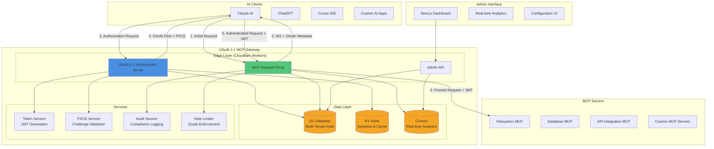

# Architecture Overview

## Table of Contents

1. [Introduction](#introduction)
2. [High-Level Architecture](#high-level-architecture)
3. [System Context](#system-context)
4. [Core Principles](#core-principles)
5. [Architecture Decision Records](#architecture-decision-records)
6. [Related Documentation](#related-documentation)

## Introduction

The OAuth 2.1 MCP Gateway is an enterprise-grade authentication and authorization proxy that transforms the Model Context Protocol (MCP) ecosystem from insecure static API keys to OAuth 2.1 with PKCE. This document provides a comprehensive overview of the system's architecture.

### What is the MCP Gateway?

The MCP Gateway acts as a security layer between AI clients (Claude, ChatGPT, Cursor, etc.) and MCP servers, providing:

- **Authentication**: OAuth 2.1 with mandatory PKCE
- **Authorization**: Scope-based access control with JWT tokens
- **Multi-Tenancy**: Complete tenant isolation and management
- **Edge Performance**: Sub-10ms latency using Cloudflare Workers
- **Enterprise Features**: Audit logging, session management, compliance

### Architecture Goals

- **Security First**: OAuth 2.1 compliance with defense-in-depth
- **Zero Trust**: No implicit trust, verify all requests
- **Multi-Tenant**: Complete isolation between tenants
- **High Performance**: Edge computing for global low-latency
- **Scalability**: Horizontal scaling to millions of requests
- **Observability**: Comprehensive audit logging and monitoring
- **Developer Experience**: Simple integration with clear documentation

## High-Level Architecture

## System Context

The gateway operates within a complex ecosystem of AI clients, identity providers, and backend MCP servers. See [context-diagram.md](./context-diagram.md) for detailed system context.

### Key Interactions

1. **AI Client ↔ Gateway**: OAuth 2.1 authentication flows with PKCE
2. **Gateway ↔ MCP Servers**: JWT-based request proxying
3. **Gateway ↔ Identity Providers**: Federated authentication (SAML, OIDC)
4. **Admin Users ↔ Dashboard**: Configuration and monitoring

## Core Principles

### 1. Security by Design

- **OAuth 2.1 Compliance**: Full implementation with mandatory PKCE
- **Zero Trust Architecture**: Verify everything, trust nothing
- **Defense in Depth**: Multiple security layers
- **Principle of Least Privilege**: Minimal access rights

### 2. Multi-Tenant Architecture

- **Complete Isolation**: Tenant data never crosses boundaries
- **Row-Level Security**: Database-level tenant isolation
- **Tenant-Specific JWT Claims**: Audience and scope validation
- **Independent Rate Limits**: Per-tenant quotas

### 3. Edge-First Performance

- **Global Distribution**: Cloudflare's edge network (300+ locations)
- **Sub-10ms Latency**: Regional data processing
- **Smart Caching**: KV-based session and token caching
- **Connection Pooling**: D1 connection optimization

### 4. Observability & Compliance

- **Comprehensive Audit Logs**: Every security-relevant action
- **Real-time Analytics**: Convex-powered live dashboards
- **Compliance Tags**: PCI-DSS, HIPAA, GDPR, SOC2
- **Distributed Tracing**: Request correlation across services

### 5. Developer Experience

- **Self-Service Onboarding**: Guided 5-minute setup
- **Rich Documentation**: API references, tutorials, examples
- **SDK Support**: TypeScript, Python, Go, Rust
- **Error Transparency**: Actionable error messages with solutions

## Architecture Decision Records

### ADR-001: Cloudflare Workers vs. Traditional Servers

**Decision**: Use Cloudflare Workers for the edge layer

**Rationale**:
- Sub-10ms latency globally (vs. 100ms+ for regional servers)
- Auto-scaling without infrastructure management
- Pay-per-request pricing model
- Built-in DDoS protection and security

**Trade-offs**:
- V8 isolate limitations (no long-running processes)
- 50ms CPU time limit per request
- Learning curve for edge computing patterns

### ADR-002: D1 vs. Traditional Databases

**Decision**: Use Cloudflare D1 (SQLite) for primary data storage

**Rationale**:
- Edge-native database with global replication
- Zero-configuration setup and management
- Strong consistency within regions
- Cost-effective for multi-tenant architecture

**Trade-offs**:
- SQLite limitations (no stored procedures)
- Eventual consistency across regions
- Limited to 10GB per database

### ADR-003: JWT vs. Opaque Tokens

**Decision**: Use JWT tokens with short expiry (15 minutes)

**Rationale**:
- Stateless validation at edge (no database lookup)
- Standard OAuth 2.1 token format
- Audience-specific claims for MCP servers
- Self-contained authorization information

**Trade-offs**:
- Cannot revoke tokens before expiry (mitigated with short TTL)
- Token size larger than opaque tokens
- Requires refresh token mechanism

### ADR-004: Convex for Real-Time Analytics

**Decision**: Use Convex for real-time analytics and dashboard

**Rationale**:
- Real-time reactive queries without polling
- TypeScript-first API with full type safety
- Built-in authentication and authorization
- Serverless with automatic scaling

**Trade-offs**:
- Additional service dependency
- Learning curve for Convex patterns
- Vendor lock-in considerations

### ADR-005: Mandatory PKCE for All Clients

**Decision**: Require PKCE for both public and confidential clients

**Rationale**:
- OAuth 2.1 best practice (vs. OAuth 2.0 optional)
- Eliminates authorization code interception attacks
- Consistent security model across client types
- Future-proof against evolving threats

**Trade-offs**:
- Slight complexity increase for client implementation
- Breaking change from traditional OAuth 2.0

## Related Documentation

- [System Context Diagram](./context-diagram.md) - C4 Level 1
- [Container Diagram](./container-diagram.md) - C4 Level 2
- [Component Diagram](./component-diagram.md) - C4 Level 3
- [Sequence Diagrams](./sequence-diagrams.md) - Key flows
- [Deployment Architecture](./deployment.md) - Infrastructure setup

---

**Next Steps**: Review the detailed C4 diagrams to understand the system at different levels of abstraction, starting with the [System Context Diagram](./context-diagram.md).
