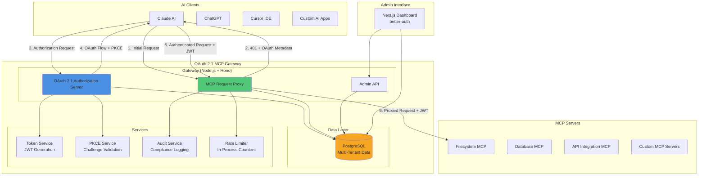

# Architecture Overview

## Table of Contents

1. [Introduction](#introduction)
2. [High-Level Architecture](#high-level-architecture)
3. [System Context](#system-context)
4. [Core Principles](#core-principles)
5. [Architecture Decision Records](#architecture-decision-records)
6. [Related Documentation](#related-documentation)

## Introduction

The OAuth 2.1 MCP Gateway is an authentication and authorization proxy that transforms the Model Context Protocol (MCP) ecosystem from insecure static API keys to OAuth 2.1 with PKCE. This document provides a comprehensive overview of the system's architecture.

### What is the MCP Gateway?

The MCP Gateway acts as a security layer between AI clients (Claude, ChatGPT, Cursor, etc.) and MCP servers, providing:

- **Authentication**: OAuth 2.1 with mandatory PKCE
- **Authorization**: Scope-based access control with JWT tokens
- **Multi-Tenancy**: Complete tenant isolation and management
- **Enterprise Features**: Audit logging, rate limiting, admin dashboard

### The Stack

- **Runtime**: Node.js 20+ running a Hono 4 application (`apps/gateway`) via `@hono/node-server`
- **Database**: PostgreSQL with Drizzle ORM (`packages/db`); migrations auto-run at gateway boot
- **Admin UI**: Next.js 15 dashboard (`apps/dashboard`) with better-auth email/password login
- **SDKs**: TypeScript (`packages/sdk-typescript`) and Python (`packages/sdk-python`)
- **Deployment**: Docker + docker-compose (self-host) or Railway (hosted)

### Architecture Goals

- **Security First**: OAuth 2.1 compliance with defense-in-depth
- **Zero Trust**: No implicit trust, verify all requests
- **Multi-Tenant**: Complete isolation between tenants
- **Simple Operations**: One container per app, one PostgreSQL database, automatic migrations
- **Observability**: Comprehensive audit logging
- **Developer Experience**: Simple integration with clear documentation

## High-Level Architecture

## System Context

The gateway operates within an ecosystem of AI clients and backend MCP servers. See [diagrams.md](./diagrams.md) for the C4 diagrams.

### Key Interactions

1. **AI Client ↔ Gateway**: OAuth 2.1 authentication flows with PKCE
2. **Gateway ↔ MCP Servers**: JWT-based request proxying
3. **Admin Users ↔ Dashboard**: Configuration and monitoring via the admin API (service-token auth)

## Core Principles

### 1. Security by Design

- **OAuth 2.1 Compliance**: Full implementation with mandatory PKCE
- **Zero Trust Architecture**: Verify everything, trust nothing
- **Defense in Depth**: Multiple security layers
- **Principle of Least Privilege**: Minimal access rights

### 2. Multi-Tenant Architecture

- **Complete Isolation**: Tenant data never crosses boundaries
- **Tenant-Scoped Queries**: Every query filters by tenant ID
- **Tenant-Specific JWT Claims**: Audience and scope validation
- **Independent Rate Limits**: Per-tenant quotas

### 3. Operational Simplicity

- **Single Runtime**: One Node.js process per gateway instance
- **Single Database**: PostgreSQL for all persistent state
- **Automatic Migrations**: Drizzle migrations applied at boot
- **Stateless Tokens**: JWT validation requires no session store

### 4. Observability & Compliance

- **Comprehensive Audit Logs**: Every security-relevant action, stored in PostgreSQL
- **Usage Metrics**: Derived from audit logs via the admin API
- **Compliance Tiers**: Configurable per tenant

### 5. Developer Experience

- **Self-Service Onboarding**: Dynamic client registration (RFC 7591)
- **Rich Documentation**: API references, tutorials, examples
- **SDK Support**: TypeScript and Python
- **Error Transparency**: Standard OAuth error responses

## Architecture Decision Records

### ADR-001: Node.js + Hono vs. Edge Runtimes

**Decision**: Run the gateway as a plain Node.js 20+ process using Hono with `@hono/node-server`

**Rationale**:
- Runs anywhere Docker runs — no vendor-specific runtime or bindings
- Hono keeps the app runtime-agnostic (the Node entry point injects the environment)
- Full Node API surface (no CPU-time or isolate limits)
- Simple local development with `tsx` watch mode

**Trade-offs**:
- No automatic global edge distribution; scale by running replicas behind a load balancer
- Operator owns TLS termination and scaling

### ADR-002: PostgreSQL + Drizzle ORM

**Decision**: Use PostgreSQL as the only datastore, accessed via Drizzle ORM

**Rationale**:
- One boring, battle-tested database for clients, tokens, tenants, MCP server registry, and audit logs
- Strong consistency and real transactions
- Drizzle gives typed schema and generated migrations (`packages/db/migrations`)
- Migrations auto-run at gateway boot — no separate deploy step

**Trade-offs**:
- Requires a managed or self-hosted PostgreSQL instance
- Vertical scaling limits before read replicas are needed

### ADR-003: JWT vs. Opaque Tokens

**Decision**: Use JWT tokens with short expiry

**Rationale**:
- Stateless validation (no database lookup per request)
- Standard OAuth 2.1 token format
- Audience-specific claims for MCP servers
- Self-contained authorization information

**Trade-offs**:
- Cannot revoke tokens before expiry (mitigated with short TTL)
- Token size larger than opaque tokens
- Requires refresh token mechanism

### ADR-004: In-Process Rate Limiting

**Decision**: Enforce rate limits with in-memory counters inside the gateway process

**Rationale**:
- No external cache dependency
- Sufficient for single-instance and small-replica deployments
- Pluggable storage interface if a shared store is ever needed

**Trade-offs**:
- Limits are per gateway instance, not global across replicas
- Counters reset on process restart

### ADR-005: Mandatory PKCE for All Clients

**Decision**: Require PKCE for both public and confidential clients

**Rationale**:
- OAuth 2.1 best practice (vs. OAuth 2.0 optional)
- Eliminates authorization code interception attacks
- Consistent security model across client types
- Future-proof against evolving threats

**Trade-offs**:
- Slight complexity increase for client implementation
- Breaking change from traditional OAuth 2.0

## Related Documentation

- [C4 Diagrams](./diagrams.md) - Context, container, component, and deployment diagrams
- [Sequence Diagrams](./flows.md) - Key flows
- [API Reference](../api-reference.md) - Endpoint documentation
- [Deployment Guide](../deployment.md) - Docker and Railway setup
