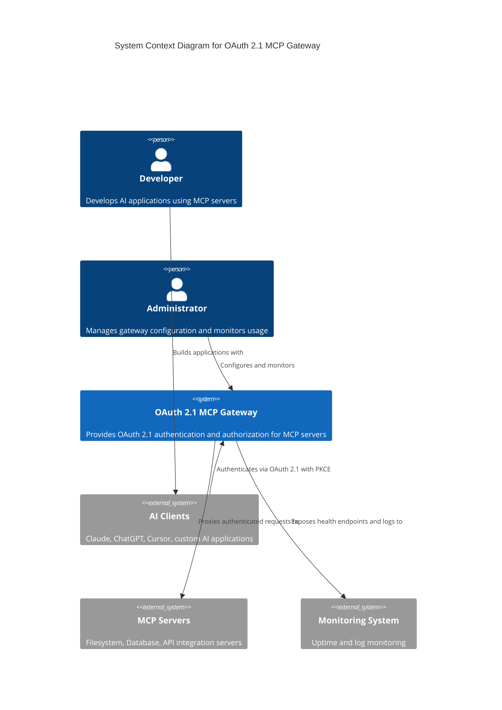
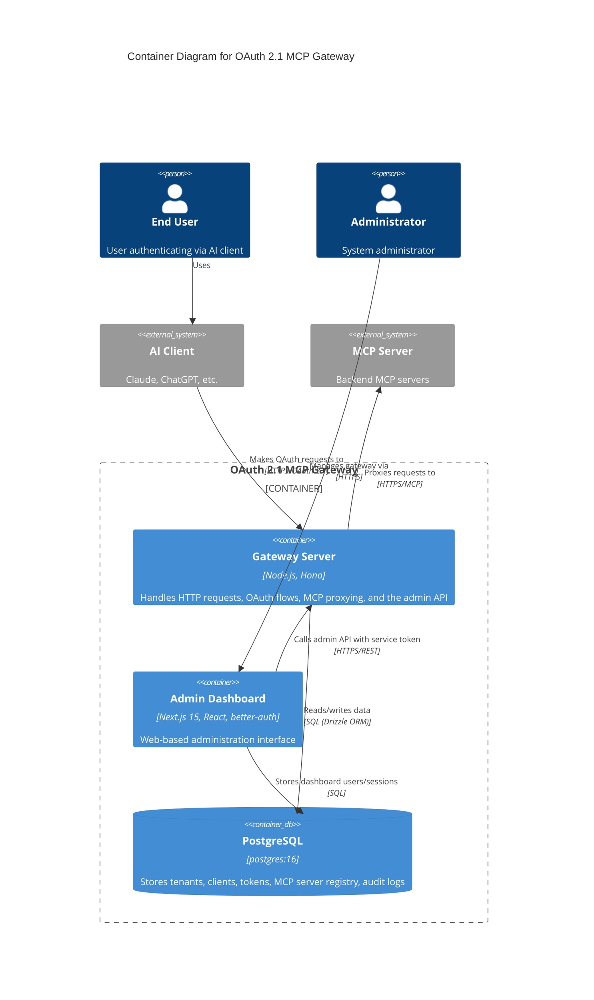
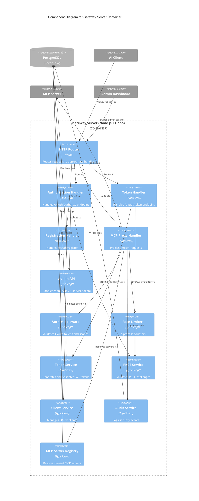
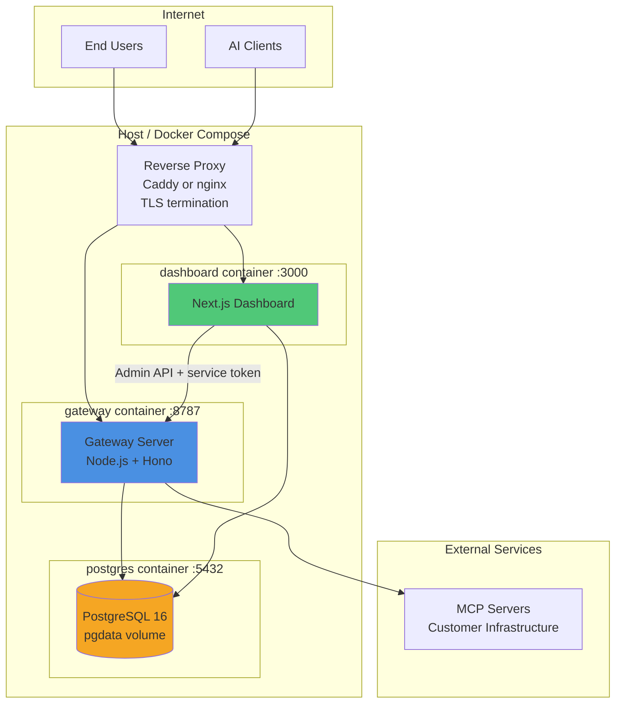

# OAuth 2.1 MCP Gateway - Architecture Diagrams

This document provides C4 model diagrams at multiple levels of abstraction to help understand the system architecture.

## Table of Contents

1. [Level 1: System Context Diagram](#level-1-system-context-diagram)
2. [Level 2: Container Diagram](#level-2-container-diagram)
3. [Level 3: Component Diagram](#level-3-component-diagram)
4. [Deployment Diagram](#deployment-diagram)

## Level 1: System Context Diagram

Shows the OAuth 2.1 MCP Gateway system and its interactions with external actors and systems.

### Key Relationships

- **Developers** build AI applications that use **AI Clients**
- **AI Clients** authenticate with the **Gateway** using OAuth 2.1
- **Gateway** proxies authenticated requests to **MCP Servers**
- **Administrators** manage the **Gateway** through the dashboard
- **Gateway** exposes health checks and logs to **Monitoring Systems**

## Level 2: Container Diagram

Shows the major containers (applications, data stores) that make up the OAuth 2.1 MCP Gateway.

### Container Responsibilities

| Container | Technology | Responsibility |
|-----------|-----------|----------------|
| **Gateway Server** | Node.js 20+ / Hono 4 | OAuth 2.1 flows, MCP proxying, admin API, rate limiting |
| **Admin Dashboard** | Next.js 15 / better-auth | Configuration UI, tenant/client/server management, audit log views |
| **PostgreSQL** | postgres:16 | All persistent state: tenants, clients, tokens, servers, audit logs, dashboard auth |

Rate limiting and caching are in-process within the gateway server — there is no separate cache store.

## Level 3: Component Diagram

Shows the internal components within the gateway server container.

### Component Details

#### HTTP Handlers

| Component | Endpoint | Responsibility |
|-----------|----------|----------------|
| **Authorization Handler** | `GET/POST /oauth/authorize` | OAuth authorization flow with PKCE |
| **Token Handler** | `POST /oauth/token` | Token exchange and refresh |
| **Registration Handler** | `POST /oauth/register` | Dynamic client registration (RFC 7591) |
| **MCP Proxy Handler** | `ALL /mcp/:serverId/*`, `ALL /mcp/resource/*` | Proxies authenticated requests to MCP servers |
| **Admin API** | `/admin/api/*` | Tenant, client, server, audit-log management (Bearer `ADMIN_TOKEN`) |

#### Middleware Components

| Component | Purpose | Implementation |
|-----------|---------|----------------|
| **Auth Middleware** | Validates Bearer tokens and required scopes | JWT verification |
| **Rate Limiter** | Prevents abuse | In-process counters (per-IP on OAuth endpoints, per-token on MCP endpoints) |

#### Service Components

| Component | Responsibility | Dependencies |
|-----------|---------------|--------------|
| **Token Service** | JWT generation/validation | PostgreSQL (refresh tokens) |
| **PKCE Service** | PKCE challenge validation | Crypto API |
| **Client Service** | OAuth client CRUD | PostgreSQL |
| **Audit Service** | Security event logging | PostgreSQL |
| **MCP Server Registry** | Tenant-scoped server lookup with in-memory TTL cache | PostgreSQL |

## Deployment Diagram

Shows the default docker-compose deployment. Railway mirrors the same topology with managed services.

### Deployment Characteristics

| Characteristic | Implementation |
|---------------|----------------|
| **Packaging** | One Docker image per app (`Dockerfile` for gateway, `apps/dashboard/Dockerfile` for dashboard) |
| **Database** | Single PostgreSQL 16 instance with a persistent volume; back up with `pg_dump` |
| **Migrations** | Drizzle migrations from `packages/db/migrations` applied automatically at gateway boot |
| **TLS** | Terminated at a reverse proxy (Caddy/nginx) or the hosting platform |
| **Scaling** | Run additional gateway replicas behind a load balancer; note rate limits are per replica |
| **Hosted option** | Railway: two services from the repo Dockerfiles + Railway Postgres plugin |

## Related Documentation

- [Architecture Overview](./README.md) - High-level architecture description
- [Sequence Diagrams](./flows.md) - Detailed flow documentation
- [API Reference](../api-reference.md) - Complete API documentation
- [Deployment Guide](../deployment.md) - Docker and Railway setup
