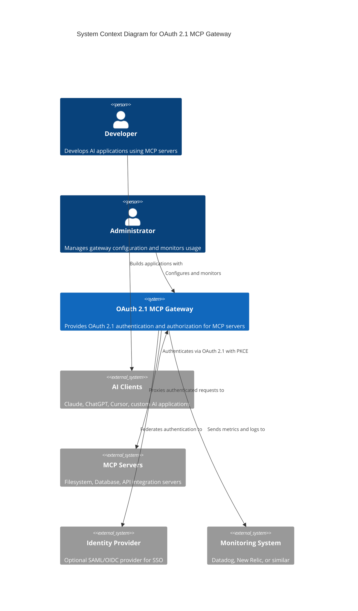
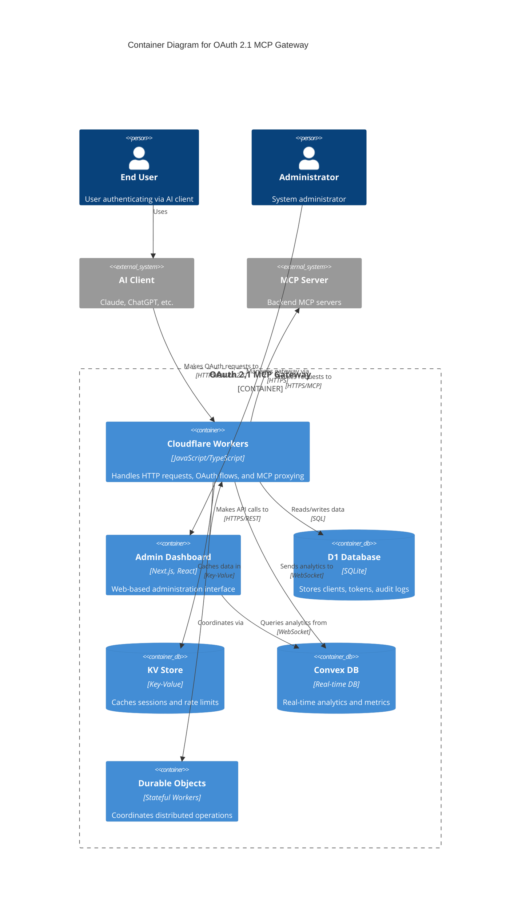
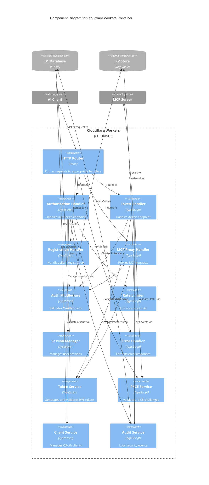
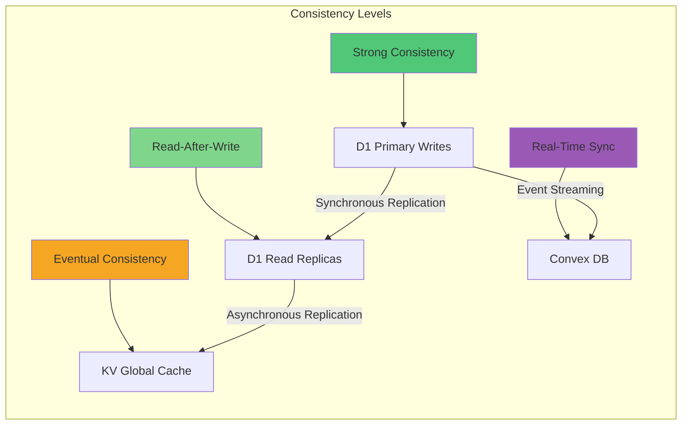

# OAuth 2.1 MCP Gateway - Architecture Diagrams

This document provides C4 model diagrams at multiple levels of abstraction to help understand the system architecture.

## Table of Contents

1. [Level 1: System Context Diagram](#level-1-system-context-diagram)
2. [Level 2: Container Diagram](#level-2-container-diagram)
3. [Level 3: Component Diagram](#level-3-component-diagram)
4. [Deployment Diagram](#deployment-diagram)

## Level 1: System Context Diagram

Shows the OAuth 2.1 MCP Gateway system and its interactions with external actors and systems.



### Key Relationships

- **Developers** build AI applications that use **AI Clients**
- **AI Clients** authenticate with the **Gateway** using OAuth 2.1
- **Gateway** proxies authenticated requests to **MCP Servers**
- **Administrators** manage the **Gateway** configuration
- **Gateway** can federate authentication to external **Identity Providers**
- **Gateway** sends observability data to **Monitoring Systems**

## Level 2: Container Diagram

Shows the major containers (applications, data stores) that make up the OAuth 2.1 MCP Gateway.



### Container Responsibilities

| Container | Technology | Responsibility |
|-----------|-----------|----------------|
| **Cloudflare Workers** | TypeScript/Hono | OAuth 2.1 flows, request routing, authentication |
| **Admin Dashboard** | Next.js/React | Configuration UI, analytics dashboard |
| **D1 Database** | SQLite | Persistent storage for clients, tokens, users |
| **KV Store** | Cloudflare KV | Session storage, rate limiting, token cache |
| **Convex DB** | Convex | Real-time analytics, metrics aggregation |
| **Durable Objects** | Stateful Workers | Distributed coordination, sequence generation |

## Level 3: Component Diagram

Shows the internal components within the Cloudflare Workers container.



### Component Details

#### HTTP Handlers

| Component | Endpoint | Responsibility |
|-----------|----------|----------------|
| **Authorization Handler** | `/authorize` | OAuth authorization flow with PKCE |
| **Token Handler** | `/token` | Token exchange and refresh |
| **Registration Handler** | `/register` | Dynamic client registration (RFC 7591) |
| **MCP Proxy Handler** | `/mcp/*` | Proxies authenticated requests to MCP servers |

#### Middleware Components

| Component | Purpose | Implementation |
|-----------|---------|----------------|
| **Auth Middleware** | Validates Bearer tokens | JWT validation with KV cache |
| **Rate Limiter** | Prevents abuse | Token bucket algorithm in KV |
| **Session Manager** | Manages user sessions | Secure session storage in KV |
| **Error Handler** | Formats errors | Enhanced OAuth error responses |

#### Service Components

| Component | Responsibility | Dependencies |
|-----------|---------------|--------------|
| **Token Service** | JWT generation/validation | D1 (token storage), KV (cache) |
| **PKCE Service** | PKCE challenge validation | Crypto API |
| **Client Service** | OAuth client CRUD | D1 (client storage) |
| **Audit Service** | Security event logging | D1 (audit logs) |

## Deployment Diagram

Shows how the system is deployed across Cloudflare's infrastructure.

```mermaid
graph TB
    subgraph "Internet"
        User[End Users]
        AI[AI Clients]
    end

    subgraph "Cloudflare Global Network"
        subgraph "Edge Locations (300+)"
            subgraph "US-West"
                WorkerUSW[Cloudflare Worker]
                CacheUSW[Local Cache]
            end

            subgraph "US-East"
                WorkerUSE[Cloudflare Worker]
                CacheUSE[Local Cache]
            end

            subgraph "EU-Central"
                WorkerEU[Cloudflare Worker]
                CacheEU[Local Cache]
            end

            subgraph "Asia-Pacific"
                WorkerAP[Cloudflare Worker]
                CacheAP[Local Cache]
            end
        end

        subgraph "Global Data Layer"
            D1Primary[(D1 Primary<br/>US-West)]
            D1Replica1[(D1 Replica<br/>US-East)]
            D1Replica2[(D1 Replica<br/>EU-Central)]

            KVGlobal[KV Global<br/>Eventually Consistent]

            ConvexDB[(Convex DB<br/>US-East)]
        end

        subgraph "Durable Objects"
            DOCoordinator[Coordination DO<br/>Jurisdiction-aware]
        end
    end

    subgraph "External Services"
        MCPServers[MCP Servers<br/>Customer Infrastructure]
        Monitoring[Monitoring<br/>Datadog/NewRelic]
    end

    subgraph "Admin Interface"
        Dashboard[Next.js Dashboard<br/>Vercel Edge]
    end

    User --> WorkerUSW
    User --> WorkerUSE
    AI --> WorkerEU
    AI --> WorkerAP

    WorkerUSW --> CacheUSW
    WorkerUSE --> CacheUSE
    WorkerEU --> CacheEU
    WorkerAP --> CacheAP

    WorkerUSW --> D1Primary
    WorkerUSE --> D1Replica1
    WorkerEU --> D1Replica2
    WorkerAP --> D1Primary

    WorkerUSW --> KVGlobal
    WorkerUSE --> KVGlobal
    WorkerEU --> KVGlobal
    WorkerAP --> KVGlobal

    WorkerUSW --> ConvexDB
    WorkerUSW --> DOCoordinator

    WorkerUSW --> MCPServers
    WorkerUSE --> MCPServers
    WorkerEU --> MCPServers
    WorkerAP --> MCPServers

    WorkerUSW --> Monitoring

    Dashboard --> WorkerUSW
    Dashboard --> ConvexDB

    style WorkerUSW fill:#4A90E2
    style WorkerUSE fill:#4A90E2
    style WorkerEU fill:#4A90E2
    style WorkerAP fill:#4A90E2
    style D1Primary fill:#50C878
    style D1Replica1 fill:#7FD68A
    style D1Replica2 fill:#7FD68A
    style KVGlobal fill:#F5A623
    style ConvexDB fill:#9B59B6
```



### Deployment Characteristics

| Characteristic | Implementation | Benefit |
|---------------|----------------|---------|
| **Geographic Distribution** | 300+ edge locations worldwide | <50ms latency globally |
| **Database Replication** | Primary + read replicas | Regional read performance |
| **Cache Strategy** | Local + KV global cache | Fast token validation |
| **Auto-Scaling** | Worker auto-scale per region | Handle traffic spikes |
| **High Availability** | Multi-region active-active | 99.99% uptime SLA |

### Data Consistency Model



## Infrastructure as Code

The entire deployment is managed using Terraform:

```
infrastructure/
├── cloudflare/
│   ├── workers.tf       # Worker configuration
│   ├── d1.tf            # Database setup
│   ├── kv.tf            # KV namespace configuration
│   └── dns.tf           # DNS and routing
├── convex/
│   └── convex.json      # Convex configuration
└── monitoring/
    ├── datadog.tf       # Monitoring setup
    └── alerts.tf        # Alert configuration
```

## Related Documentation

- [Architecture Overview](./README.md) - High-level architecture description
- [Sequence Diagrams](./flows.md) - Detailed flow documentation
- [API Reference](../api-reference.md) - Complete API documentation
- [Deployment Guide](../deployment.md) - Infrastructure setup guide
