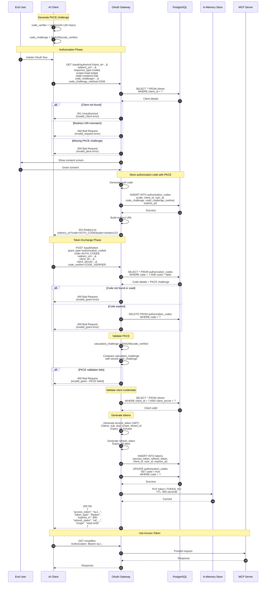
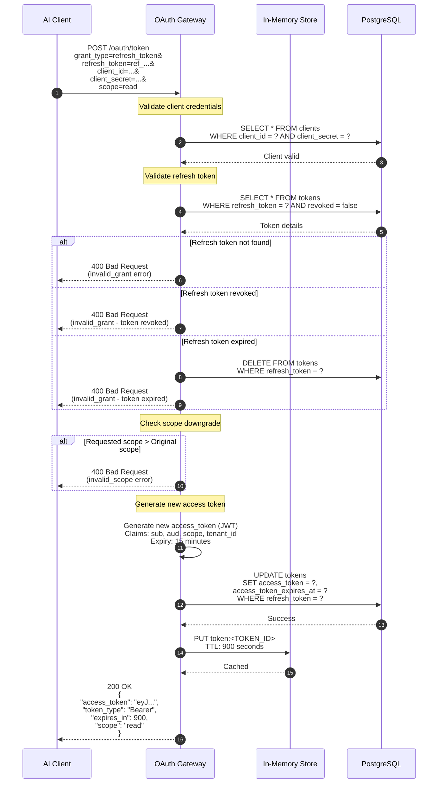
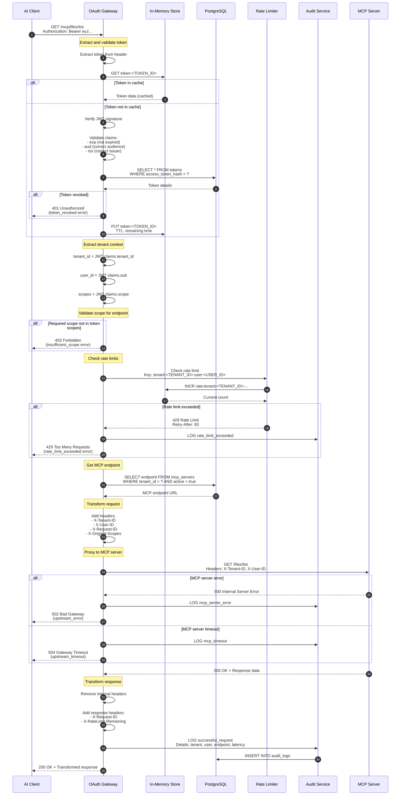
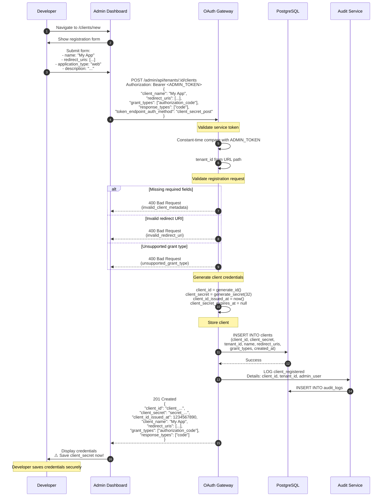
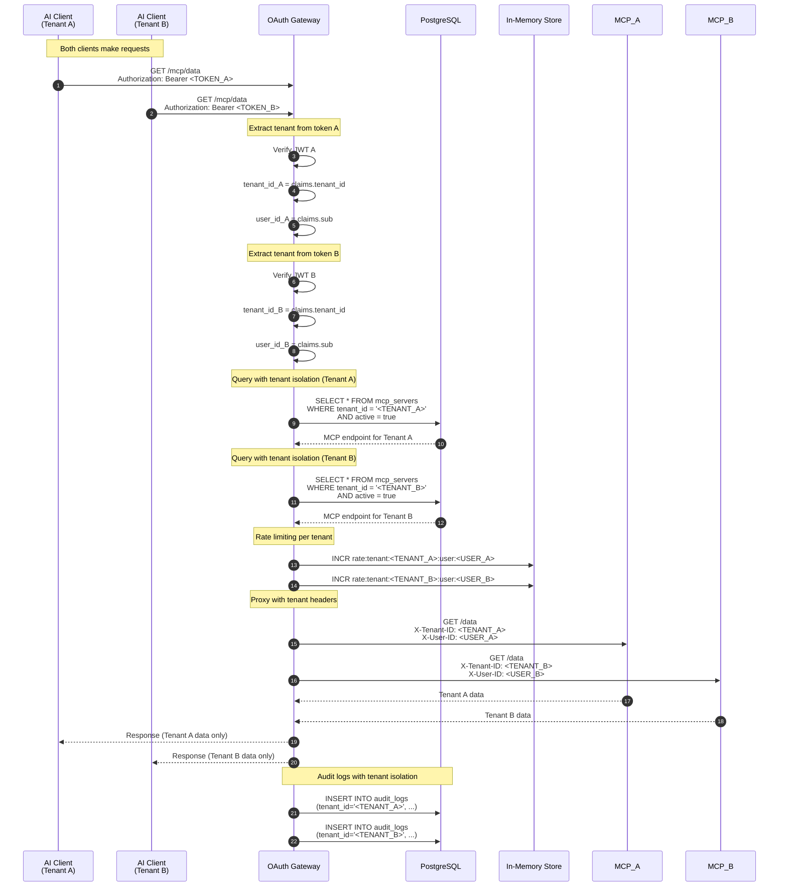
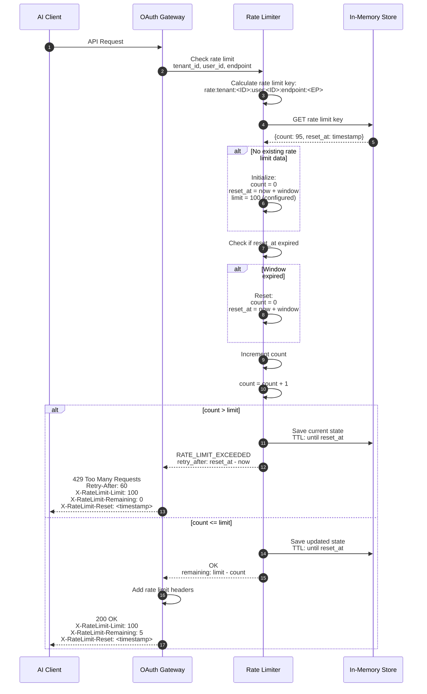
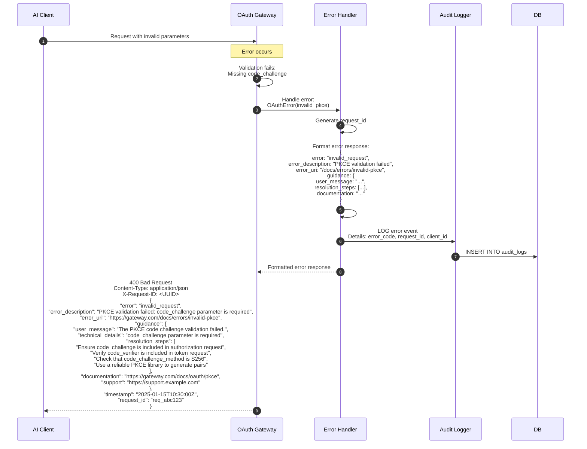

# OAuth 2.1 MCP Gateway - Sequence Diagrams

This document provides detailed sequence diagrams for all major flows in the OAuth 2.1 MCP Gateway system.

## Table of Contents

1. [OAuth 2.1 Authorization Code Flow](#oauth-21-authorization-code-flow)
2. [Token Refresh Flow](#token-refresh-flow)
3. [MCP Request Proxying](#mcp-request-proxying)
4. [Client Registration Flow](#client-registration-flow)
5. [Multi-Tenant Request Handling](#multi-tenant-request-handling)
6. [Rate Limiting Flow](#rate-limiting-flow)
7. [Session Management Flow](#session-management-flow)
8. [Error Handling Flow](#error-handling-flow)

## OAuth 2.1 Authorization Code Flow

Complete flow from initial authorization request through token exchange with PKCE.



### Key Security Features

1. **PKCE Protection**: Prevents authorization code interception
2. **One-Time Code**: Authorization codes can only be used once
3. **Code Expiry**: Codes expire after 10 minutes
4. **State Validation**: Prevents CSRF attacks
5. **Client Authentication**: Validates client credentials
6. **Short-Lived Tokens**: Access tokens expire in 15 minutes

## Token Refresh Flow

Refreshing an expired access token using a refresh token.



### Refresh Token Security

1. **Single Use**: Option to rotate refresh tokens on use
2. **Revocation**: Can be revoked independently
3. **Scope Reduction**: Can request narrower scope
4. **Client Binding**: Tied to specific client
5. **Long TTL**: 30 days (configurable)

## MCP Request Proxying

Authenticated request proxying to MCP servers with tenant isolation.



### MCP Proxy Features

1. **Token Validation**: JWT verification with caching
2. **Tenant Isolation**: Tenant-aware routing
3. **Scope Enforcement**: Per-endpoint scope requirements
4. **Rate Limiting**: Per-tenant and per-user limits
5. **Audit Logging**: Complete request audit trail
6. **Circuit Breaker**: Prevents cascading failures

## Client Registration Flow

Dynamic client registration (RFC 7591) for self-service onboarding.



Clients can also self-register directly against the public `POST /oauth/register` endpoint (RFC 7591) without an admin token.

### Registration Security

1. **Admin Authentication**: Dashboard-driven registration uses the `ADMIN_TOKEN` service token
2. **Tenant Isolation**: Clients scoped to tenant
3. **URI Validation**: Strict redirect URI validation
4. **Secure Secret Generation**: Cryptographically random secrets
5. **Audit Trail**: All registrations logged

## Multi-Tenant Request Handling

How tenant isolation is enforced throughout the request lifecycle.



### Tenant Isolation Guarantees

1. **JWT Claims**: Tenant ID embedded in token
2. **Database Queries**: All queries include `WHERE tenant_id = ?`
3. **Rate Limits**: Separate limits per tenant
4. **Cache Keys**: Tenant ID in all cache keys
5. **Audit Logs**: Tenant-scoped logging
6. **Row-Level Security**: Database-level isolation

## Rate Limiting Flow

Token bucket algorithm implementation for rate limiting.



### Rate Limiting Configuration

| Level | Window | Limit | Scope |
|-------|--------|-------|-------|
| **Per-IP** | 1 minute | 60 | Global |
| **Per-Client** | 1 hour | 10,000 | Per endpoint type |
| **Per-Tenant** | 1 hour | 100,000 | All endpoints |
| **Per-User** | 1 hour | 1,000 | Per endpoint |

## Session Management Flow

Secure session lifecycle with regeneration on authentication.

```mermaid
sequenceDiagram
    autonumber
    participant User as End User
    participant Browser as Browser
    participant Gateway as OAuth Gateway
    participant Mem as In-Memory Store

    Note over Browser,Gateway: Initial Session Creation
    Browser->>Gateway: GET /oauth/authorize (first visit)
    Gateway->>Gateway: Generate session ID
    Gateway->>Gateway: session_data = {<br/>  id: uuid(),<br/>  created_at: now(),<br/>  csrf_token: random()<br/>}
    Gateway->>Mem: PUT session:<SESSION_ID><br/>TTL: 1800 seconds
    Gateway-->>Browser: Set-Cookie: session_id=...<br/>HttpOnly; Secure; SameSite=Strict

    Note over User,Gateway: User Authentication
    User->>Browser: Enter credentials
    Browser->>Gateway: POST /login<br/>Cookie: session_id=OLD_ID

    Gateway->>Mem: GET session:OLD_ID
    Mem-->>Gateway: Old session data

    Gateway->>Gateway: Validate CSRF token
    Gateway->>Gateway: Authenticate user

    Note over Gateway: Session Regeneration (Security)
    Gateway->>Gateway: Generate NEW session ID
    Gateway->>Gateway: new_session_data = {<br/>  id: new_uuid(),<br/>  user_id: USER_ID,<br/>  authenticated_at: now(),<br/>  csrf_token: new_random()<br/>}

    Gateway->>Mem: PUT session:NEW_ID<br/>TTL: 3600 seconds
    Gateway->>Mem: DELETE session:OLD_ID

    Gateway-->>Browser: Set-Cookie: session_id=NEW_ID<br/>HttpOnly; Secure; SameSite=Strict

    Note over Browser,Gateway: Subsequent Requests
    Browser->>Gateway: GET /dashboard<br/>Cookie: session_id=NEW_ID

    Gateway->>Mem: GET session:NEW_ID
    Mem-->>Gateway: Session data with user_id

    alt Session expired
        Gateway->>Mem: DELETE session:NEW_ID
        Gateway-->>Browser: 401 Unauthorized<br/>Redirect to /login
    else Session valid
        Gateway->>Gateway: Extend session TTL
        Gateway->>Mem: EXPIRE session:NEW_ID 3600
        Gateway-->>Browser: 200 OK + Page content
    end

    Note over User,Gateway: Logout
    User->>Browser: Click logout
    Browser->>Gateway: POST /logout<br/>Cookie: session_id=NEW_ID

    Gateway->>Mem: DELETE session:NEW_ID
    Gateway-->>Browser: Clear-Cookie: session_id<br/>Redirect to /login
```

### Session Security Features

1. **Session Regeneration**: New ID after authentication
2. **HttpOnly Cookies**: Prevents XSS access
3. **Secure Flag**: HTTPS only
4. **SameSite=Strict**: CSRF protection
5. **Short TTL**: 30-minute inactivity timeout
6. **CSRF Tokens**: Per-session tokens

## Error Handling Flow

Enhanced error responses with user guidance and resolution steps.



### Error Response Features

1. **OAuth 2.1 Compliance**: Standard error codes
2. **User Guidance**: Clear, actionable messages
3. **Resolution Steps**: Step-by-step fixes
4. **Documentation Links**: Relevant docs
5. **Request Tracking**: Unique request IDs
6. **Audit Logging**: All errors logged

## Related Documentation

- [Architecture Overview](./README.md) - System architecture
- [Component Diagrams](./diagrams.md) - C4 diagrams
- [API Reference](../api-reference.md) - Endpoint documentation
- [Deployment Guide](../deployment.md) - Docker and Railway setup
